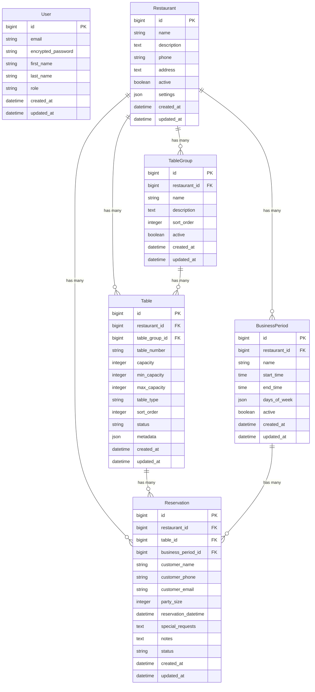

# 餐廳訂位系統 - 資料庫關聯圖

## 系統概述

這是一個簡化的餐廳訂位系統，專注於核心功能：

-   用戶管理（管理員、經理、員工）
-   餐廳管理
-   桌位管理（按群組分類）
-   營業時段管理
-   訂位管理

## 資料庫關聯圖

## 模型關聯說明

### User（用戶）

-   **角色**: admin（管理員）、manager（經理）、staff（員工）
-   **功能**: 系統登入、權限管理
-   **特點**: 使用 Devise 進行認證

### Restaurant（餐廳）

-   **核心實體**: 系統的主要業務實體
-   **設定**: 使用 JSON 欄位儲存各種業務設定
-   **關聯**: 擁有所有其他業務實體

### TableGroup（桌位群組）

-   **用途**: 將桌位按區域或類型分組
-   **範例**: 主用餐區、VIP 包廂區、吧台區
-   **排序**: 支援自訂排序順序

### Table（桌位）

-   **屬性**: 桌號、容量、桌位類型、狀態
-   **容量**: 支援最小/最大容量設定
-   **狀態**: available、occupied、reserved、maintenance、cleaning
-   **類型**: regular、round、square、booth、bar、private_room

### BusinessPeriod（營業時段）

-   **用途**: 定義餐廳營業時間
-   **範例**: 午餐時段、晚餐時段
-   **彈性**: 支援不同星期的營業時間

### Reservation（訂位）

-   **核心功能**: 客戶訂位管理
-   **狀態**: pending、confirmed、seated、completed、cancelled、no_show
-   **資訊**: 客戶資料、人數、時間、特殊需求

## 簡化設計決策

1. **移除併桌功能**: 不再支援 TableCombination，每個訂位只對應一個桌位
2. **移除候補清單**: 不實作 WaitingList 功能，專注於核心訂位流程
3. **單一餐廳**: 目前設計支援多餐廳，但實際使用可能專注於單一餐廳

## 索引設計

### 重要索引

-   `tables(restaurant_id, table_number)` - 唯一索引
-   `tables(status)` - 查詢可用桌位
-   `tables(capacity)` - 按容量查詢
-   `reservations(restaurant_id, reservation_datetime)` - 查詢特定時間訂位
-   `reservations(status)` - 按狀態查詢訂位

## 資料完整性

### 外鍵約束

-   所有關聯都有適當的外鍵約束
-   使用 `dependent: :destroy` 或 `dependent: :nullify` 處理級聯刪除

### 驗證規則

-   所有必要欄位都有 presence 驗證
-   電話號碼格式驗證
-   電子郵件格式驗證
-   人數範圍驗證
-   訂位時間未來時間驗證

## 效能考量

### 查詢優化

-   使用 `includes` 避免 N+1 查詢
-   適當的資料庫索引
-   複雜查詢使用 scope 封裝

### 快取策略

-   餐廳設定快取
-   桌位狀態快取
-   統計資料快取
