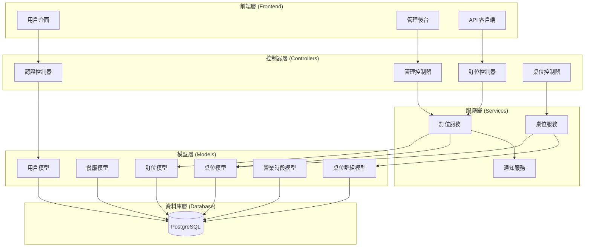
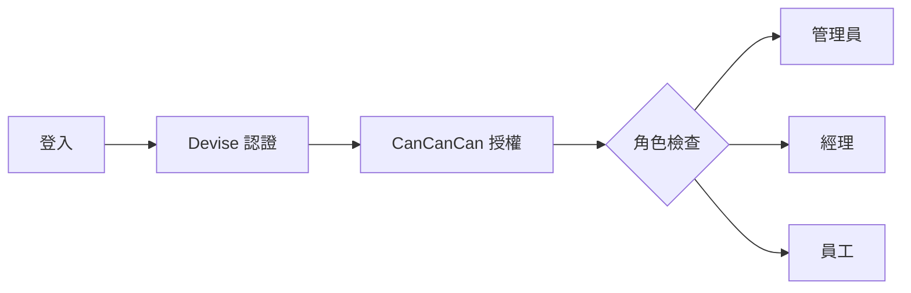
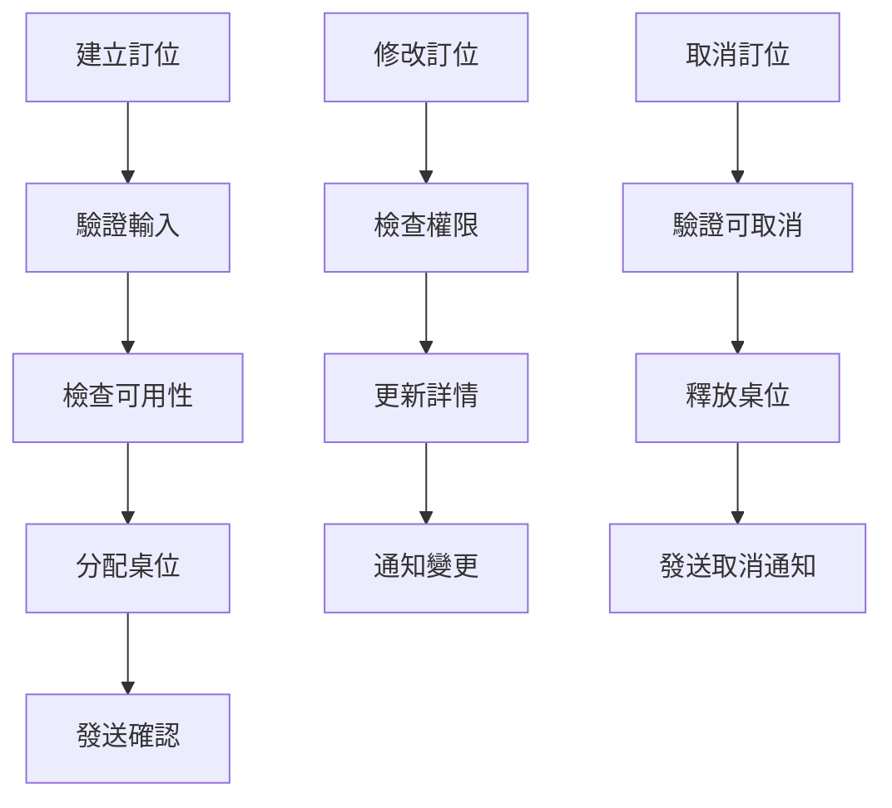
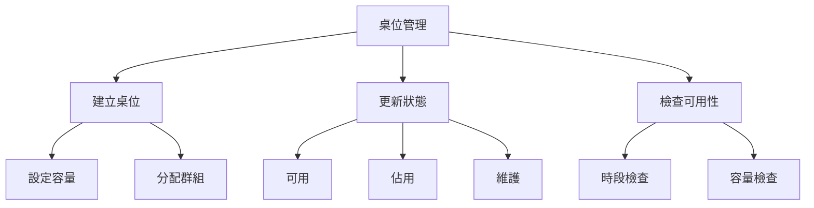
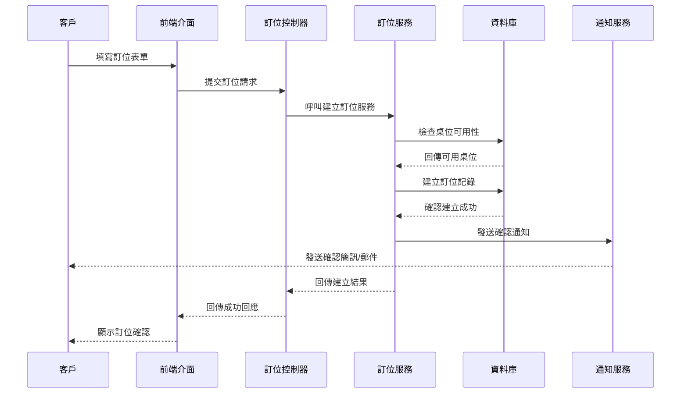
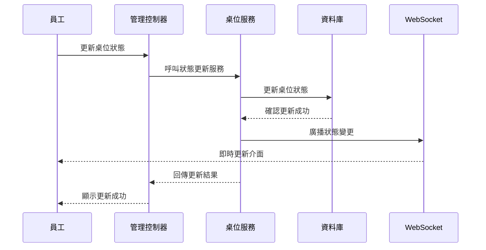

# 餐廳訂位系統 - 系統架構

## 系統架構圖

## 核心功能模組

### 1. 認證與授權模組

### 2. 訂位管理模組

### 3. 桌位管理模組

## 技術棧

### 後端技術

-   **框架**: Ruby on Rails 7.1
-   **資料庫**: PostgreSQL
-   **認證**: Devise
-   **授權**: CanCanCan
-   **背景任務**: Sidekiq
-   **API**: RESTful API

### 前端技術

-   **框架**: Hotwire (Turbo + Stimulus)
-   **樣式**: Bootstrap 5
-   **建構工具**: esbuild
-   **即時更新**: Turbo Streams

### 開發工具

-   **測試**: RSpec + FactoryBot + Capybara
-   **程式碼品質**: RuboCop
-   **安全檢查**: Brakeman
-   **依賴管理**: Bundler

## 資料流程

### 訂位建立流程

### 桌位狀態更新流程

## 安全性設計

### 認證安全

-   使用 Devise 進行用戶認證
-   密碼加密儲存
-   會話管理和超時控制

### 授權控制

-   基於角色的權限控制 (RBAC)
-   資源層級的權限檢查
-   API 端點權限驗證

### 資料安全

-   SQL 注入防護 (ActiveRecord)
-   XSS 防護 (Rails 內建)
-   CSRF 保護
-   敏感資料加密

## 效能優化

### 資料庫優化

-   適當的索引設計
-   查詢優化 (避免 N+1)
-   連接池管理

### 快取策略

-   頁面片段快取
-   查詢結果快取
-   靜態資源快取

### 前端優化

-   資源壓縮和合併
-   圖片優化
-   懶載入技術

## 監控與日誌

### 應用監控

-   效能監控
-   錯誤追蹤
-   使用者行為分析

### 日誌管理

-   結構化日誌
-   日誌等級管理
-   日誌輪轉和保存

### 健康檢查

-   資料庫連接檢查
-   外部服務檢查
-   系統資源監控
