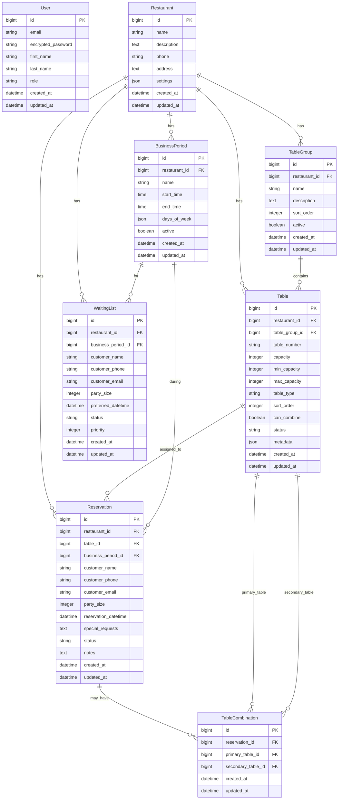

# 餐廳訂位系統架構設計

## 系統架構概覽

### 技術堆疊

-   **後端框架**: Ruby on Rails 7.1+
-   **前端技術**: Hotwire (Turbo + Stimulus)
-   **資料庫**: PostgreSQL 15+
-   **快取**: Redis 7+
-   **背景任務**: Sidekiq
-   **WebSocket**: ActionCable
-   **樣式框架**: Tailwind
-   **測試框架**: RSpec + Capybara

### 系統分層架構

```
┌─────────────────────────────────────────────────────────────┐
│                        前端層 (Presentation)                │
├─────────────────────────────────────────────────────────────┤
│  Hotwire (Turbo + Stimulus) │ Tailwind │ ActionCable    │
├─────────────────────────────────────────────────────────────┤
│                        控制器層 (Controller)                │
├─────────────────────────────────────────────────────────────┤
│  Admin Controllers │ API Controllers │ Auth Controllers     │
├─────────────────────────────────────────────────────────────┤
│                        服務層 (Service)                     │
├─────────────────────────────────────────────────────────────┤
│  ReservationService │ TableAllocationService │ NotificationService │
├─────────────────────────────────────────────────────────────┤
│                        模型層 (Model)                       │
├─────────────────────────────────────────────────────────────┤
│  ActiveRecord Models │ Business Logic │ Validations        │
├─────────────────────────────────────────────────────────────┤
│                        資料層 (Data)                        │
├─────────────────────────────────────────────────────────────┤
│  PostgreSQL │ Redis Cache │ File Storage                    │
└─────────────────────────────────────────────────────────────┘
```

## 資料庫設計 (ERD)

### 核心實體關係



### 資料庫索引策略

```sql
-- 效能關鍵索引
CREATE INDEX idx_reservations_datetime ON reservations(reservation_datetime);
CREATE INDEX idx_reservations_status ON reservations(status);
CREATE INDEX idx_reservations_restaurant_datetime ON reservations(restaurant_id, reservation_datetime);
CREATE INDEX idx_tables_restaurant_group ON tables(restaurant_id, table_group_id);
CREATE INDEX idx_tables_status ON tables(status);
CREATE INDEX idx_business_periods_active ON business_periods(active, restaurant_id);

-- 複合索引
CREATE INDEX idx_reservations_search ON reservations(restaurant_id, reservation_datetime, status);
CREATE INDEX idx_table_availability ON tables(restaurant_id, status, can_combine);
```

## 模型設計

### 核心模型結構

```ruby
# app/models/restaurant.rb
class Restaurant < ApplicationRecord
  has_many :table_groups, dependent: :destroy
  has_many :tables, dependent: :destroy
  has_many :business_periods, dependent: :destroy
  has_many :reservations, dependent: :destroy
  has_many :waiting_lists, dependent: :destroy

  validates :name, presence: true
  validates :phone, presence: true

  # 設定序列化欄位
  serialize :settings, type: Hash, coder: JSON

  def default_settings
    {
      allow_table_combination: true,
      auto_assign_tables: true,
      advance_booking_days: 30,
      cancellation_deadline_hours: 2,
      waiting_list_enabled: true
    }
  end
end

# app/models/table_group.rb
class TableGroup < ApplicationRecord
  belongs_to :restaurant
  has_many :tables, -> { order(:sort_order) }, dependent: :destroy

  validates :name, presence: true
  validates :sort_order, presence: true, uniqueness: { scope: :restaurant_id }

  scope :active, -> { where(active: true) }
  scope :ordered, -> { order(:sort_order) }
end

# app/models/table.rb
class Table < ApplicationRecord
  belongs_to :restaurant
  belongs_to :table_group
  has_many :reservations, dependent: :destroy
  has_many :primary_combinations, class_name: 'TableCombination', foreign_key: 'primary_table_id'
  has_many :secondary_combinations, class_name: 'TableCombination', foreign_key: 'secondary_table_id'

  validates :table_number, presence: true, uniqueness: { scope: :restaurant_id }
  validates :capacity, presence: true, numericality: { greater_than: 0 }
  validates :status, inclusion: { in: %w[available occupied maintenance cleaning] }

  scope :available, -> { where(status: 'available') }
  scope :can_combine, -> { where(can_combine: true) }
  scope :by_group_priority, -> { joins(:table_group).order('table_groups.sort_order, tables.sort_order') }

  def available_at?(datetime)
    !reservations.active.where(
      'reservation_datetime <= ? AND reservation_datetime + INTERVAL \'2 hours\' > ?',
      datetime, datetime
    ).exists?
  end

  def suitable_for?(party_size)
    (min_capacity || 1) <= party_size && party_size <= (max_capacity || capacity)
  end
end

# app/models/reservation.rb
class Reservation < ApplicationRecord
  belongs_to :restaurant
  belongs_to :table, optional: true
  belongs_to :business_period, optional: true
  has_many :table_combinations, dependent: :destroy
  has_many :combined_tables, through: :table_combinations, source: :secondary_table

  validates :customer_name, presence: true
  validates :customer_phone, presence: true
  validates :party_size, presence: true, numericality: { greater_than: 0 }
  validates :reservation_datetime, presence: true
  validates :status, inclusion: { in: %w[pending confirmed seated completed cancelled no_show] }

  scope :active, -> { where.not(status: %w[cancelled no_show completed]) }
  scope :for_date, ->(date) { where(reservation_datetime: date.beginning_of_day..date.end_of_day) }
  scope :confirmed, -> { where(status: 'confirmed') }

  before_validation :set_business_period, if: :reservation_datetime_changed?

  private

  def set_business_period
    period = restaurant.business_periods.active.find do |bp|
      bp.covers_time?(reservation_datetime)
    end
    self.business_period = period
  end
end
```

## 服務層設計

### 核心服務類別

```ruby
# app/services/table_allocation_service.rb
class TableAllocationService
  def initialize(restaurant)
    @restaurant = restaurant
  end

  def allocate_table(reservation)
    return unless reservation.pending?

    suitable_tables = find_suitable_tables(reservation)
    allocated_table = select_optimal_table(suitable_tables, reservation)

    if allocated_table
      assign_table(reservation, allocated_table)
    elsif @restaurant.settings['allow_table_combination']
      attempt_table_combination(reservation)
    else
      add_to_waiting_list(reservation)
    end
  end

  private

  def find_suitable_tables(reservation)
    @restaurant.tables
      .available
      .joins(:table_group)
      .where('tables.capacity >= ? OR tables.can_combine = ?',
             reservation.party_size, true)
      .order('table_groups.sort_order, tables.sort_order')
      .select { |table| table.available_at?(reservation.reservation_datetime) }
  end

  def select_optimal_table(tables, reservation)
    # 優先選擇容量最接近的桌位
    perfect_match = tables.find { |t| t.suitable_for?(reservation.party_size) }
    return perfect_match if perfect_match

    # 次選：可併桌的桌位
    tables.find(&:can_combine)
  end

  def attempt_table_combination(reservation)
    combinable_tables = @restaurant.tables.can_combine.available

    combinable_tables.combination(2).each do |table_pair|
      total_capacity = table_pair.sum(&:capacity)
      if total_capacity >= reservation.party_size
        return create_table_combination(reservation, table_pair)
      end
    end

    add_to_waiting_list(reservation)
  end
end

# app/services/reservation_service.rb
class ReservationService
  def initialize(restaurant)
    @restaurant = restaurant
  end

  def create_reservation(params)
    reservation = @restaurant.reservations.build(params)

    if reservation.save
      TableAllocationService.new(@restaurant).allocate_table(reservation)
      NotificationService.new.send_confirmation(reservation)
      reservation
    else
      reservation
    end
  end

  def cancel_reservation(reservation, reason = nil)
    return false unless reservation.can_cancel?

    reservation.update!(status: 'cancelled', notes: reason)
    release_allocated_tables(reservation)
    process_waiting_list
    NotificationService.new.send_cancellation(reservation)

    true
  end

  private

  def release_allocated_tables(reservation)
    reservation.table&.update!(status: 'available')
    reservation.table_combinations.destroy_all
  end

  def process_waiting_list
    WaitingListService.new(@restaurant).process_next_in_queue
  end
end
```

## Hotwire 整合架構

### Turbo 配置

```ruby
# config/importmap.rb
pin '@hotwired/turbo-rails', to: 'turbo.min.js'
pin '@hotwired/stimulus', to: 'stimulus.min.js'
pin 'stimulus-loading', to: 'stimulus-loading.js'
pin_all_from 'app/javascript/controllers', under: 'controllers'

# app/javascript/application.js
import '@hotwired/turbo-rails'
import './controllers'
```

### Stimulus 控制器結構

```javascript
// app/javascript/controllers/table_management_controller.js
import { Controller } from '@hotwired/stimulus'
import Sortable from 'sortablejs'

export default class extends Controller {
  static targets = ['tableGroup', 'table', 'sortOrder']
  static values = { url: String }

  connect() {
    this.initializeSortable()
  }

  initializeSortable() {
    this.tableGroupTargets.forEach(group => {
      Sortable.create(group.querySelector('.table-list'), {
        group: 'tables',
        animation: 150,
        ghostClass: 'sortable-ghost',
        onEnd: this.updateSortOrder.bind(this)
      })
    })
  }

  async updateSortOrder(event) {
    const tableId = event.item.dataset.tableId
    const newGroupId = event.to.closest('[data-group-id]').dataset.groupId
    const newIndex = event.newIndex

    const response = await fetch(this.urlValue, {
      method: 'PATCH',
      headers: {
        'Content-Type': 'application/json',
        'X-CSRF-Token': document.querySelector('[name="csrf-token"]').content
      },
      body: JSON.stringify({
        table_id: tableId,
        table_group_id: newGroupId,
        sort_order: newIndex
      })
    })

    if (!response.ok) {
      // 回復原始位置
      this.revertSortOrder(event)
    }
  }
}

// app/javascript/controllers/reservation_controller.js
import { Controller } from '@hotwired/stimulus'

export default class extends Controller {
  static targets = ['form', 'tableSelect', 'partySize', 'datetime']
  static values = { checkAvailabilityUrl: String }

  async checkAvailability() {
    const formData = new FormData()
    formData.append('party_size', this.partySizeTarget.value)
    formData.append('datetime', this.datetimeTarget.value)

    const response = await fetch(this.checkAvailabilityUrlValue, {
      method: 'POST',
      body: formData,
      headers: {
        'X-CSRF-Token': document.querySelector('[name="csrf-token"]').content
      }
    })

    const html = await response.text()
    this.tableSelectTarget.innerHTML = html
  }

  datetimeChanged() {
    this.checkAvailability()
  }

  partySizeChanged() {
    this.checkAvailability()
  }
}
```

### Turbo Streams 實作

```ruby
# app/controllers/admin/reservations_controller.rb
class Admin::ReservationsController < AdminController
  def create
    @reservation = ReservationService.new(current_restaurant).create_reservation(reservation_params)

    if @reservation.persisted?
      respond_to do |format|
        format.turbo_stream do
          render turbo_stream: [
            turbo_stream.prepend('reservations', partial: 'reservation', locals: { reservation: @reservation }),
            turbo_stream.update('reservation_form', partial: 'form', locals: { reservation: Reservation.new }),
            turbo_stream.update('dashboard_stats', partial: 'shared/dashboard_stats')
          ]
        end
        format.html { redirect_to admin_reservations_path }
      end
    else
      respond_to do |format|
        format.turbo_stream do
          render turbo_stream: turbo_stream.update('reservation_form',
                 partial: 'form', locals: { reservation: @reservation })
        end
        format.html { render :new }
      end
    end
  end

  def update_status
    @reservation = current_restaurant.reservations.find(params[:id])
    @reservation.update!(status: params[:status])

    respond_to do |format|
      format.turbo_stream do
        render turbo_stream: [
          turbo_stream.replace("reservation_#{@reservation.id}",
                              partial: 'reservation', locals: { reservation: @reservation }),
          turbo_stream.update('dashboard_stats', partial: 'shared/dashboard_stats')
        ]
      end
    end
  end
end
```

## WebSocket 即時更新

### ActionCable 配置

```ruby
# app/channels/restaurant_channel.rb
class RestaurantChannel < ApplicationCable::Channel
  def subscribed
    restaurant = Restaurant.find(params[:restaurant_id])
    stream_for restaurant
  end

  def unsubscribed
    stop_all_streams
  end
end

# app/models/reservation.rb (添加 callback)
class Reservation < ApplicationRecord
  after_update_commit :broadcast_status_change
  after_create_commit :broadcast_new_reservation

  private

  def broadcast_status_change
    RestaurantChannel.broadcast_to(
      restaurant,
      {
        type: 'reservation_updated',
        reservation: ReservationSerializer.new(self).as_json,
        html: ApplicationController.render(
          partial: 'admin/reservations/reservation',
          locals: { reservation: self }
        )
      }
    )
  end

  def broadcast_new_reservation
    RestaurantChannel.broadcast_to(
      restaurant,
      {
        type: 'new_reservation',
        reservation: ReservationSerializer.new(self).as_json,
        html: ApplicationController.render(
          partial: 'admin/reservations/reservation',
          locals: { reservation: self }
        )
      }
    )
  end
end
```

### JavaScript WebSocket 處理

```javascript
// app/javascript/controllers/realtime_controller.js
import { Controller } from '@hotwired/stimulus'
import consumer from '../channels/consumer'

export default class extends Controller {
    static values = { restaurantId: Number }

    connect() {
        this.subscription = consumer.subscriptions.create(
            { channel: 'RestaurantChannel', restaurant_id: this.restaurantIdValue },
            {
                received: this.handleMessage.bind(this),
            }
        )
    }

    disconnect() {
        if (this.subscription) {
            this.subscription.unsubscribe()
        }
    }

    handleMessage(data) {
        switch (data.type) {
            case 'new_reservation':
                this.addNewReservation(data.html)
                this.showNotification('新訂位', data.reservation.customer_name)
                break
            case 'reservation_updated':
                this.updateReservation(data.reservation.id, data.html)
                break
            case 'table_status_changed':
                this.updateTableStatus(data.table_id, data.status)
                break
        }
    }

    addNewReservation(html) {
        const reservationsList = document.getElementById('reservations')
        if (reservationsList) {
            reservationsList.insertAdjacentHTML('afterbegin', html)
            this.highlightNewElement(reservationsList.firstElementChild)
        }
    }

    updateReservation(reservationId, html) {
        const element = document.getElementById(`reservation_${reservationId}`)
        if (element) {
            element.outerHTML = html
        }
    }

    showNotification(title, message) {
        // 實作通知顯示邏輯
        if ('Notification' in window && Notification.permission === 'granted') {
            new Notification(title, { body: message })
        }
    }

    highlightNewElement(element) {
        element.classList.add('highlight-new')
        setTimeout(() => element.classList.remove('highlight-new'), 3000)
    }
}
```

## API 設計

### RESTful API 端點

```ruby
# config/routes.rb
Rails.application.routes.draw do
  devise_for :users
  root 'reservations#new'

  # 公開訂位 API
  resources :reservations, only: [:new, :create, :show] do
    member do
      patch :cancel
    end
    collection do
      post :check_availability
    end
  end

  # 管理後台
  namespace :admin do
    root 'dashboard#index'

    resources :restaurants do
      resources :table_groups do
        member do
          patch :update_sort_order
        end
      end

      resources :tables do
        member do
          patch :update_status
          patch :update_sort_order
        end
        collection do
          patch :batch_update_sort_order
        end
      end

      resources :business_periods

      resources :reservations do
        member do
          patch :update_status
          patch :assign_table
        end
        collection do
          get :calendar
          post :check_availability
        end
      end

      resources :waiting_lists do
        member do
          patch :promote
        end
      end

      resources :reports, only: [:index] do
        collection do
          get :daily_summary
          get :table_utilization
          get :customer_analytics
        end
      end
    end
  end

  # API v1
  namespace :api do
    namespace :v1 do
      resources :restaurants, only: [:show] do
        resources :availability, only: [:index]
        resources :reservations, only: [:create, :show, :update]
      end
    end
  end
end
```

### API 控制器範例

```ruby
# app/controllers/api/v1/base_controller.rb
class Api::V1::BaseController < ApplicationController
  protect_from_forgery with: :null_session
  before_action :set_default_format

  rescue_from ActiveRecord::RecordNotFound, with: :not_found
  rescue_from ActiveRecord::RecordInvalid, with: :unprocessable_entity

  private

  def set_default_format
    request.format = :json
  end

  def not_found(exception)
    render json: { error: 'Resource not found' }, status: :not_found
  end

  def unprocessable_entity(exception)
    render json: {
      error: 'Validation failed',
      details: exception.record.errors.full_messages
    }, status: :unprocessable_entity
  end
end

# app/controllers/api/v1/reservations_controller.rb
class Api::V1::ReservationsController < Api::V1::BaseController
  before_action :find_restaurant
  before_action :find_reservation, only: [:show, :update]

  def create
    @reservation = ReservationService.new(@restaurant).create_reservation(reservation_params)

    if @reservation.persisted?
      render json: ReservationSerializer.new(@reservation), status: :created
    else
      render json: {
        error: 'Failed to create reservation',
        details: @reservation.errors.full_messages
      }, status: :unprocessable_entity
    end
  end

  def show
    render json: ReservationSerializer.new(@reservation)
  end

  def update
    service = ReservationService.new(@restaurant)

    case params[:action_type]
    when 'cancel'
      success = service.cancel_reservation(@reservation, params[:reason])
    when 'modify'
      success = service.modify_reservation(@reservation, reservation_params)
    else
      success = @reservation.update(reservation_params)
    end

    if success
      render json: ReservationSerializer.new(@reservation.reload)
    else
      render json: {
        error: 'Failed to update reservation',
        details: @reservation.errors.full_messages
      }, status: :unprocessable_entity
    end
  end

  private

  def find_restaurant
    @restaurant = Restaurant.find(params[:restaurant_id])
  end

  def find_reservation
    @reservation = @restaurant.reservations.find(params[:id])
  end

  def reservation_params
    params.require(:reservation).permit(
      :customer_name, :customer_phone, :customer_email,
      :party_size, :reservation_datetime, :special_requests
    )
  end
end
```

## 序列化器設計

```ruby
# app/serializers/application_serializer.rb
class ApplicationSerializer
  include JSONAPI::Serializer
end

# app/serializers/reservation_serializer.rb
class ReservationSerializer < ApplicationSerializer
  attributes :id, :customer_name, :customer_phone, :party_size,
             :reservation_datetime, :status, :special_requests, :created_at

  attribute :table_info do |reservation|
    if reservation.table
      {
        table_number: reservation.table.table_number,
        table_group: reservation.table.table_group.name
      }
    end
  end

  attribute :business_period_info do |reservation|
    if reservation.business_period
      {
        name: reservation.business_period.name,
        time_range: "#{reservation.business_period.start_time.strftime('%H:%M')} - #{reservation.business_period.end_time.strftime('%H:%M')}"
      }
    end
  end
end

# app/serializers/table_serializer.rb
class TableSerializer < ApplicationSerializer
  attributes :id, :table_number, :capacity, :table_type, :status,
             :can_combine, :sort_order

  belongs_to :table_group
  has_many :reservations, if: Proc.new { |record, params|
    params && params[:include_reservations]
  }

  attribute :availability_status do |table|
    {
      current_status: table.status,
      next_reservation: table.reservations.active
                            .where('reservation_datetime > ?', Time.current)
                            .order(:reservation_datetime)
                            .first&.reservation_datetime
    }
  end
end
```

## 背景任務處理

### Sidekiq 設定

```ruby
# config/schedule.rb (whenever gem)
every 10.minutes do
  runner "ProcessWaitingListJob.perform_async"
end

every 1.hour do
  runner "ReservationReminderJob.perform_async"
end

every 1.day, at: '2:00 am' do
  runner "DailyReportJob.perform_async"
end

# app/jobs/application_job.rb
class ApplicationJob < ActiveJob::Base
  queue_as :default

  retry_on StandardError, wait: 5.seconds, attempts: 3
  discard_on ActiveJob::DeserializationError
end

# app/jobs/process_waiting_list_job.rb
class ProcessWaitingListJob < ApplicationJob
  def perform
    Restaurant.includes(:waiting_lists).each do |restaurant|
      WaitingListService.new(restaurant).process_pending_requests
    end
  end
end

# app/jobs/reservation_reminder_job.rb
class ReservationReminderJob < ApplicationJob
  def perform
    tomorrow_reservations = Reservation.confirmed
                                     .where(reservation_datetime: 1.day.from_now.beginning_of_day..1.day.from_now.end_of_day)

    tomorrow_reservations.find_each do |reservation|
      NotificationService.new.send_reminder(reservation)
    end
  end
end

# app/jobs/table_status_cleanup_job.rb
class TableStatusCleanupJob < ApplicationJob
  def perform
    # 清理已過期的桌位佔用狀態
    expired_reservations = Reservation.where(
      status: 'seated',
      reservation_datetime: ..2.hours.ago
    )

    expired_reservations.find_each do |reservation|
      reservation.update!(status: 'completed')
      reservation.table&.update!(status: 'available')
    end
  end
end
```

## 快取策略

### Redis 快取設定

```ruby
# config/environments/production.rb
config.cache_store = :redis_cache_store, {
  url: ENV['REDIS_URL'],
  expires_in: 1.hour,
  namespace: 'restaurant_booking'
}

# app/models/concerns/cacheable.rb
module Cacheable
  extend ActiveSupport::Concern

  included do
    after_update_commit :clear_cache
    after_destroy_commit :clear_cache
  end

  def cache_key_with_version
    "#{cache_key}/#{cache_version}"
  end

  private

  def clear_cache
    Rails.cache.delete_matched("#{self.class.name.downcase}:*")
  end
end

# app/services/availability_service.rb
class AvailabilityService
  def initialize(restaurant)
    @restaurant = restaurant
  end

  def available_times(date, party_size)
    cache_key = "availability:#{@restaurant.id}:#{date}:#{party_size}"

    Rails.cache.fetch(cache_key, expires_in: 10.minutes) do
      calculate_available_times(date, party_size)
    end
  end

  private

  def calculate_available_times(date, party_size)
    business_periods = @restaurant.business_periods.active
    available_slots = []

    business_periods.each do |period|
      if period.active_on?(date)
        slots = generate_time_slots(period, date)
        available_slots += filter_available_slots(slots, party_size)
      end
    end

    available_slots.sort
  end

  def generate_time_slots(period, date)
    slots = []
    current_time = period.start_time_on(date)
    end_time = period.end_time_on(date)

    while current_time < end_time
      slots << current_time
      current_time += 30.minutes
    end

    slots
  end

  def filter_available_slots(slots, party_size)
    slots.select do |slot|
      has_available_table?(slot, party_size)
    end
  end

  def has_available_table?(datetime, party_size)
    suitable_tables = @restaurant.tables
                                .available
                                .where('capacity >= ? OR can_combine = ?', party_size, true)

    suitable_tables.any? { |table| table.available_at?(datetime) }
  end
end
```

## 安全性設計

### 認證與授權

```ruby
# app/models/ability.rb (CanCanCan)
class Ability
  include CanCan::Ability

  def initialize(user)
    user ||= User.new

    case user.role
    when 'admin'
      can :manage, :all
    when 'manager'
      can :manage, [Restaurant, TableGroup, Table, BusinessPeriod]
      can :read, [Reservation, WaitingList]
      can :update, Reservation, status: ['confirmed', 'seated', 'completed', 'cancelled']
    when 'staff'
      can :read, [Table, Reservation, WaitingList]
      can :update, Table, status: ['available', 'occupied', 'cleaning']
      can :update, Reservation, status: ['seated', 'completed']
    else
      can :create, Reservation
      can :read, Reservation, customer_phone: user.phone if user.phone.present?
    end
  end
end

# app/controllers/concerns/authorization.rb
module Authorization
  extend ActiveSupport::Concern

  included do
    before_action :authenticate_user!, except: [:new, :create, :show]
    load_and_authorize_resource except: [:new, :create]
  end

  private

  def current_restaurant
    @current_restaurant ||= current_user&.restaurant || Restaurant.first
  end
end
```

### 輸入驗證與清理

```ruby
# app/models/concerns/sanitizable.rb
module Sanitizable
  extend ActiveSupport::Concern

  def sanitize_input(input)
    return nil if input.blank?
    ActionController::Base.helpers.sanitize(input.strip)
  end

  def sanitize_phone(phone)
    return nil if phone.blank?
    phone.gsub(/\D/, '')
  end

  def sanitize_email(email)
    return nil if email.blank?
    email.strip.downcase
  end
end

# app/models/reservation.rb (更新)
class Reservation < ApplicationRecord
  include Sanitizable

  before_validation :sanitize_inputs

  validates :customer_name, presence: true, length: { maximum: 50 }
  validates :customer_phone, presence: true, format: { with: /\A\d{8,15}\z/ }
  validates :customer_email, format: { with: URI::MailTo::EMAIL_REGEXP }, allow_blank: true
  validates :party_size, numericality: { in: 1..20 }

  private

  def sanitize_inputs
    self.customer_name = sanitize_input(customer_name)
    self.customer_phone = sanitize_phone(customer_phone)
    self.customer_email = sanitize_email(customer_email)
    self.special_requests = sanitize_input(special_requests)
  end
end
```

## 效能優化策略

### 資料庫查詢優化

```ruby
# app/controllers/admin/dashboard_controller.rb
class Admin::DashboardController < AdminController
  def index
    @stats = Rails.cache.fetch("dashboard_stats:#{current_restaurant.id}", expires_in: 5.minutes) do
      calculate_dashboard_stats
    end
  end

  private

  def calculate_dashboard_stats
    today = Date.current
    restaurant = current_restaurant

    {
      today_reservations: restaurant.reservations.for_date(today).count,
      confirmed_reservations: restaurant.reservations.for_date(today).confirmed.count,
      table_utilization: calculate_table_utilization(restaurant, today),
      revenue_estimate: calculate_revenue_estimate(restaurant, today),
      upcoming_reservations: restaurant.reservations
                                      .includes(:table, :business_period)
                                      .where(reservation_datetime: Time.current..1.day.from_now)
                                      .order(:reservation_datetime)
                                      .limit(10)
    }
  end

  def calculate_table_utilization(restaurant, date)
    total_tables = restaurant.tables.count
    return 0 if total_tables.zero?

    occupied_hours = restaurant.reservations
                              .for_date(date)
                              .confirmed
                              .sum { |r| 2 } # 假設每個訂位佔用2小時

    total_available_hours = total_tables * 12 # 假設每天營業12小時
    (occupied_hours.to_f / total_available_hours * 100).round(2)
  end
end

# app/models/concerns/scopes.rb
module Scopes
  extend ActiveSupport::Concern

  included do
    scope :with_associations, -> { includes(:table, :table_group, :business_period) }
    scope :recent, -> { order(created_at: :desc) }
    scope :search_by_customer, ->(term) {
      where('customer_name ILIKE ? OR customer_phone LIKE ?', "%#{term}%", "%#{term}%")
    }
  end
end
```

## 監控與日誌

### 應用程式監控

```ruby
# config/application.rb
config.log_level = :info
config.log_tags = [:request_id, :remote_ip]

# app/controllers/concerns/loggable.rb
module Loggable
  extend ActiveSupport::Concern

  private

  def log_user_action(action, resource = nil)
    Rails.logger.info({
      user_id: current_user&.id,
      action: action,
      resource: resource&.class&.name,
      resource_id: resource&.id,
      ip_address: request.remote_ip,
      user_agent: request.user_agent,
      timestamp: Time.current
    }.to_json)
  end
end

# app/middleware/request_timing.rb
class RequestTiming
  def initialize(app)
    @app = app
  end

  def call(env)
    start_time = Time.current
    status, headers, response = @app.call(env)
    end_time = Time.current

    if (end_time - start_time) > 1.second
      Rails.logger.warn("Slow request: #{env['REQUEST_METHOD']} #{env['REQUEST_PATH']} took #{end_time - start_time}s")
    end

    [status, headers, response]
  end
end
```

## 部署架構

### Docker 設定

```dockerfile
# Dockerfile
FROM ruby:3.2-alpine

RUN apk add --no-cache \
  build-base \
  postgresql-dev \
  nodejs \
  yarn \
  tzdata

WORKDIR /app

COPY Gemfile Gemfile.lock ./
RUN bundle install --without development test

COPY package.json yarn.lock ./
RUN yarn install --production

COPY . .

RUN bundle exec rails assets:precompile

EXPOSE 3000

CMD ["bundle", "exec", "rails", "server", "-b", "0.0.0.0"]
```

```yaml
# docker-compose.yml
version: '3.8'

services:
    web:
        build: .
        ports:
            - '3000:3000'
        environment:
            - DATABASE_URL=postgresql://postgres:password@db:5432/restaurant_booking_production
            - REDIS_URL=redis://redis:6379/0
        depends_on:
            - db
            - redis
        volumes:
            - ./storage:/app/storage

    db:
        image: postgres:15-alpine
        environment:
            - POSTGRES_DB=restaurant_booking_production
            - POSTGRES_PASSWORD=password
        volumes:
            - postgres_data:/var/lib/postgresql/data

    redis:
        image: redis:7-alpine
        volumes:
            - redis_data:/data

    sidekiq:
        build: .
        command: bundle exec sidekiq
        environment:
            - DATABASE_URL=postgresql://postgres:password@db:5432/restaurant_booking_production
            - REDIS_URL=redis://redis:6379/0
        depends_on:
            - db
            - redis

volumes:
    postgres_data:
    redis_data:
```

這個架構設計提供了一個完整、可擴展且高效能的餐廳訂位系統基礎。通過 Rails 7 + Hotwire 的現代化技術棧，結合精心設計的資料庫結構和服務層，能夠滿足複雜的餐廳管理需求。
